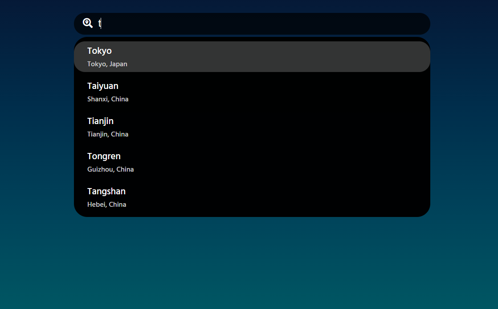
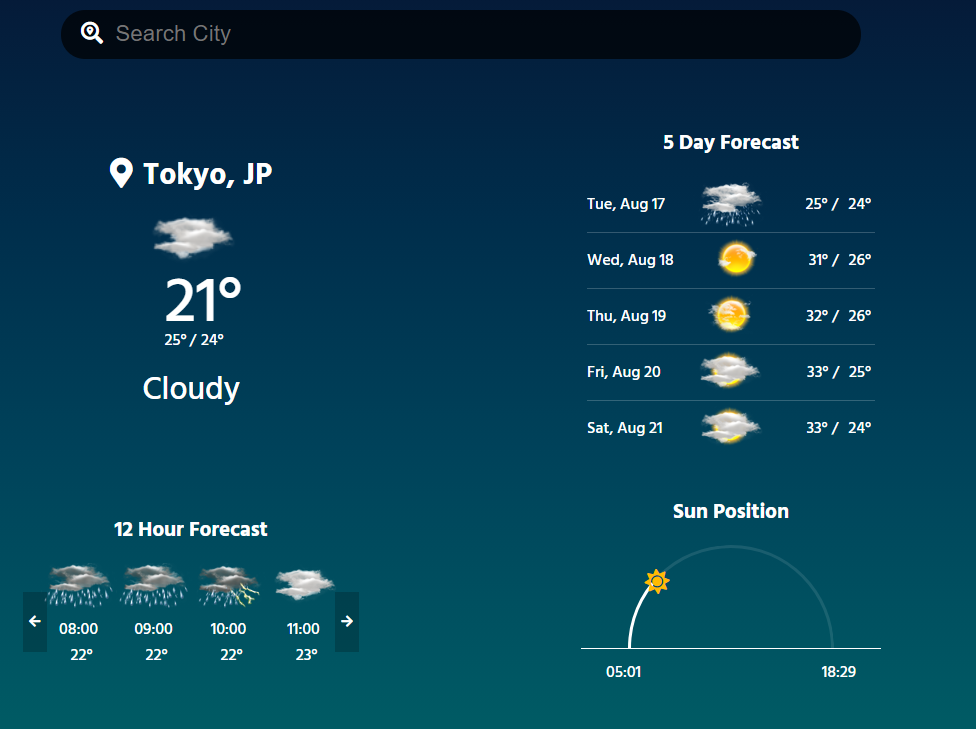

# React Weahter App

## Table of contents

- [Overview](#overview)
  - [The challenge](#the-challenge)
  - [Screenshot](#screenshot)
  - [Links](#links)
  - [Built with](#built-with)
- [Author](#author)

## Overview

This is web app created with React

### The challenge

Users should be able to:

- Search for the city they want to get weather information for
- Get weather information about the city they searched for

### Screenshot

### Links

- Live Site URL: [React-weather-app](https://weather-react-v.netlify.app/)

### Built with

- CSS Flex
- CSS Grid
- AccuWeather Api - RestApi
- Mobile-first workflow
- React - JS library
- Redux - State management library

## Author

- Website - [Ventsislav Borislavov](https://ventsislav-borislavov.netlify.app/)
